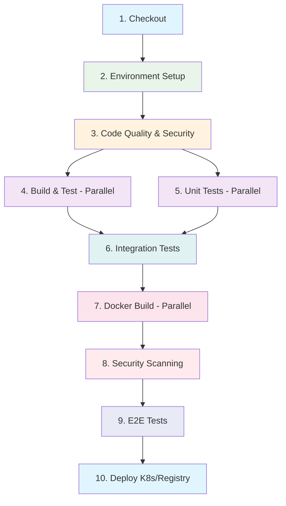

# Jenkins Pipeline Visualization - Complete Guide

## 🎯 Transport Microservices Pipeline Overview

### **Architecture Overview**
```
┌──────────────────────────────────────────────────────────────┐
│                    TRANSPORT MICROSERVICES                   │
│                         CI/CD Pipeline                       │
└──────────────────────────────────────────────────────────────┘

🔄 Source Code (Git) → 🏗️ Jenkins Pipeline → 🐳 Docker Registry → ☸️ Kubernetes
```

### **10-Stage Pipeline Visualization**



---

## 🚀 Quick Setup Guide

### **Step 1: Start Jenkins**

#### Option A: Using Docker (Recommended)
```bash
# Clone the repository
git clone <your-repo-url>
cd mymicroservices

# Start Jenkins with our configuration
docker-compose -f docker-compose.jenkins.yml up -d

# Wait for Jenkins to start
sleep 60

# Access Jenkins
open http://localhost:8080
```

#### Option B: Run Setup Script
```bash
# Linux/macOS
./jenkins-setup.sh

# Windows PowerShell
.\jenkins-setup.ps1
```

### **Step 2: Initial Jenkins Configuration**

#### **1. Unlock Jenkins**
```bash
# Get initial admin password
docker exec jenkins-master cat /var/jenkins_home/secrets/initialAdminPassword
```

#### **2. Install Required Plugins**
Navigate to: **Manage Jenkins** → **Manage Plugins** → **Available**

**Essential Plugins:**
```
✅ Blue Ocean                    # Modern pipeline UI
✅ Pipeline Stage View           # Classic stage visualization
✅ Maven Integration             # Maven build support
✅ NodeJS Plugin                 # Node.js support
✅ Docker Plugin                 # Docker integration
✅ Kubernetes Plugin             # Kubernetes deployment
✅ Checkstyle Plugin             # Code quality
✅ JaCoCo Plugin                 # Code coverage
✅ HTML Publisher                # HTML reports
✅ Email Extension               # Enhanced notifications
```

#### **3. Configure Global Tools**
Navigate to: **Manage Jenkins** → **Global Tool Configuration**

**Maven Configuration:**
```
Name: Maven-3.9.0
✅ Install automatically
Version: 3.9.0
```

**Node.js Configuration:**
```
Name: NodeJS-18
✅ Install automatically
Version: 18.x.x (Latest LTS)
Global npm packages: eslint
```

**Docker Configuration:**
```
Name: Docker
✅ Install automatically
Installation root: /usr/bin/docker
```

### **Step 3: Set Up Credentials**

Navigate to: **Manage Jenkins** → **Manage Credentials** → **System** → **Global credentials**

**Required Credentials:**

| Credential ID | Type | Description |
|---------------|------|-------------|
| `docker-registry-url` | Secret text | `https://index.docker.io/v1/` |
| `docker-registry-credentials` | Username/Password | Docker Hub login |
| `github-credentials` | Username/Password | GitHub access |
| `k8s-config` | Secret file | Kubernetes config file |

### **Step 4: Create Pipeline Job**

#### **Manual Creation:**
1. **New Item** → **Pipeline**
2. **Job Name:** `transport-microservices-pipeline`
3. **Pipeline Definition:** Pipeline script from SCM
4. **SCM:** Git
5. **Repository URL:** Your Git repository
6. **Credentials:** Select github-credentials
7. **Script Path:** `Jenkinsfile`
8. **Save**

#### **Import Configuration:**
```bash
# Upload the job configuration
curl -X POST "$JENKINS_URL/createItem?name=transport-microservices-pipeline" \
     --header "Content-Type: application/xml" \
     --data-binary @jenkins-job-config.xml
```

---

## 📊 Pipeline Visualization Options

### **🎨 1. Blue Ocean (Recommended)**

**Access:** http://localhost:8080/blue

**Features:**
- ✅ Modern, intuitive interface
- ✅ Real-time pipeline execution
- ✅ Branch-based visualization
- ✅ Detailed log viewer with search
- ✅ Visual pipeline editor
- ✅ Artifact browser
- ✅ Test result visualization

**Visual Elements:**
```
┌─────────────────────────────────────────────────────────┐
│  Blue Ocean Pipeline View                               │
├─────────────────────────────────────────────────────────┤
│                                                         │
│  ┌──────┐ ┌──────┐ ┌──────┐ ┌──────┐ ┌──────┐         │
│  │ ✅ │─│ ✅ │─│ ✅ │─│ 🔄 │─│ ⏸️ │         │
│  │Check │ │Build │ │Test  │ │Scan  │ │Deploy│         │
│  └──────┘ └──────┘ └──────┘ └──────┘ └──────┘         │
│                                                         │
│  📊 Duration: 12m 34s    📈 Success: 95%              │
└─────────────────────────────────────────────────────────┘
```

### **📈 2. Classic Stage View**

**Access:** Job Dashboard → **Stage View**

**Features:**
- ✅ Stage execution time tracking
- ✅ Historical trend analysis
- ✅ Parallel stage visualization
- ✅ Build artifacts access
- ✅ Stage failure analysis

**Visual Layout:**
```
Stage View - Transport Microservices Pipeline
┌─────────────────────────────────────────────────────────────┐
│ Build #42 | ✅ Checkout | ✅ Setup | ✅ Quality | ⏱️ 2m 15s │
│ Build #41 | ✅ Checkout | ✅ Setup | ❌ Quality | ⏱️ 1m 45s │
│ Build #40 | ✅ Checkout | ✅ Setup | ✅ Quality | ⏱️ 2m 30s │
└─────────────────────────────────────────────────────────────┘
```

### **📊 3. Pipeline Graph View**

**Access:** Job → **Pipeline Graph**

**Features:**
- ✅ Node-based visualization
- ✅ Dependency mapping
- ✅ Execution flow analysis
- ✅ Parallel stage identification

### **🖥️ 4. Build Monitor View**

**Access:** Dashboard → **Build Monitor**

**Features:**
- ✅ Large screen display
- ✅ Multi-project overview
- ✅ Real-time status updates
- ✅ Color-coded status indicators

---

## 📋 Pipeline Stage Details

### **Stage 1: Checkout**
```groovy
stage('Checkout') {
    steps {
        checkout scm
        script {
            currentBuild.displayName = "#${env.BUILD_NUMBER}-v${APP_VERSION}"
        }
    }
}
```
**Duration:** ~30 seconds
**Visualization:** Source code retrieval status

### **Stage 2: Environment Setup**
```groovy
stage('Environment Setup') {
    steps {
        script {
            echo "Maven version: ${sh(script: 'mvn --version', returnStdout: true)}"
            echo "Node.js version: ${sh(script: 'node --version', returnStdout: true)}"
            echo "Docker version: ${sh(script: 'docker --version', returnStdout: true)}"
        }
    }
}
```
**Duration:** ~1 minute
**Visualization:** Tool verification status

### **Stage 3: Code Quality & Security (Parallel)**
```groovy
stage('Code Quality & Security') {
    parallel {
        stage('Backend Code Analysis') { ... }
        stage('Frontend Code Analysis') { ... }
        stage('Security Scan') { ... }
    }
}
```
**Duration:** ~3 minutes
**Visualization:** Parallel execution with individual progress

### **Stage 4-5: Build & Test (Parallel)**
```groovy
stage('Build & Test') {
    parallel {
        stage('Backend Services Build') { ... }
        stage('Frontend Build') { ... }
    }
}
```
**Duration:** ~5 minutes
**Visualization:** Service-by-service build progress

### **Stage 6: Integration Tests**
**Duration:** ~2 minutes
**Visualization:** Docker Compose startup and test execution

### **Stage 7: Docker Build (Parallel)**
```groovy
stage('Build Docker Images') {
    parallel {
        stage('Build User Service Image') { ... }
        stage('Build Ticket Service Image') { ... }
        stage('Build Subscription Service Image') { ... }
        stage('Build Route Service Image') { ... }
        stage('Build Bus Geolocation Service Image') { ... }
        stage('Build API Gateway Image') { ... }
        stage('Build Frontend Image') { ... }
    }
}
```
**Duration:** ~4 minutes
**Visualization:** 7 parallel Docker builds

### **Stage 8: Security Scanning**
**Duration:** ~2 minutes
**Visualization:** Trivy security scan results

### **Stage 9: E2E Tests**
**Duration:** ~3 minutes
**Visualization:** Full application stack testing

### **Stage 10: Deployment**
```groovy
stage('Deploy to Staging') {
    when { branch 'develop' }
    // Kubernetes deployment
}

stage('Deploy to Production') {
    when { branch 'main' }
    // Manual approval + deployment
}
```
**Duration:** ~2-5 minutes
**Visualization:** Kubernetes rollout status

---

## 🔍 Monitoring Dashboard

### **Key Performance Indicators**

| Metric | Target | Alert Threshold | Visualization |
|--------|---------|-----------------|---------------|
| **Build Success Rate** | >95% | <90% | 📈 Trend Chart |
| **Build Duration** | <15 min | >20 min | ⏱️ Duration Graph |
| **Test Coverage** | >80% | <75% | 📊 Coverage Trend |
| **Security Issues** | 0 High/Critical | >0 High | 🔒 Security Dashboard |
| **Deployment Frequency** | Daily | <Weekly | 🚀 Deployment Chart |

### **Custom Dashboard Widgets**

#### **1. Pipeline Status Overview**
```
┌─────────────────────────────────────────┐
│ Transport Microservices Pipeline Status │
├─────────────────────────────────────────┤
│ 🟢 Last Build: #42 - SUCCESS           │
│ ⏱️ Duration: 12m 34s                   │
│ 🔄 Stage: Deployed to Staging          │
│ 📊 Success Rate: 96% (last 20 builds)  │
│ 🧪 Test Coverage: 87%                  │
│ 🔒 Security Issues: 0 Critical         │
└─────────────────────────────────────────┘
```

#### **2. Service Build Status**
```
┌─────────────────────┬─────────┬──────────┐
│ Service             │ Status  │ Duration │
├─────────────────────┼─────────┼──────────┤
│ 🔧 User Service     │ ✅ PASS │ 2m 15s   │
│ 🎫 Ticket Service   │ ✅ PASS │ 2m 30s   │
│ 📋 Subscription     │ ✅ PASS │ 1m 45s   │
│ 🗺️ Route Service    │ ✅ PASS │ 2m 00s   │
│ 🚌 Bus Geolocation  │ ✅ PASS │ 1m 30s   │
│ 🌐 API Gateway      │ ✅ PASS │ 1m 20s   │
│ 💻 Frontend App     │ ✅ PASS │ 3m 10s   │
└─────────────────────┴─────────┴──────────┘
```

#### **3. Deployment Pipeline Flow**
```
Development → Staging → Production
     ↓           ↓         ↓
   Auto        Auto     Manual
  Deploy     Deploy   Approval
    🔄          ✅        ⏸️
```

---

## 🔔 Alerts & Notifications

### **Email Notifications**

**Configuration:**
```groovy
post {
    failure {
        emailext (
            subject: "❌ Build Failed: ${env.JOB_NAME} - ${env.BUILD_NUMBER}",
            body: """
                <h2>Build Failed!</h2>
                <p>Job: ${env.JOB_NAME}</p>
                <p>Build: ${env.BUILD_NUMBER}</p>
                <p>Branch: ${env.BRANCH_NAME}</p>
                <p>URL: ${env.BUILD_URL}</p>
            """,
            to: "${env.CHANGE_AUTHOR_EMAIL}"
        )
    }
}
```

**Notification Types:**
- ✅ Build success/failure
- ✅ Security vulnerabilities found
- ✅ Deployment completion
- ✅ Test coverage threshold breach
- ✅ Long-running build alerts

### **Slack Integration** (Optional)

**Setup:**
1. Install Slack plugin
2. Configure Slack workspace
3. Add webhook URL to credentials
4. Configure notification stages

---

## 📊 Reporting & Analytics

### **Built-in Reports**

#### **1. Test Results Trend**
```
📈 Test Results - Last 30 Days
┌─────────────────────────────────┐
│ Tests: 1,247 ✅ | 3 ❌ | 0 ⏭️   │
│ Success Rate: 99.8%             │
│ Coverage: 87% (+2% this week)   │
│ Duration: 4m 32s (avg)          │
└─────────────────────────────────┘
```

#### **2. Build Duration Analysis**
```
⏱️ Build Performance Trend
Stage                   Avg Duration    Trend
────────────────────────────────────────────
Checkout                     15s        📈 +2s
Environment Setup            45s        📉 -5s
Code Quality                180s        ➡️ stable
Build & Test                300s        📈 +15s
Integration Tests           120s        📉 -10s
Docker Build               240s        ➡️ stable
Security Scan              90s         📉 -20s
E2E Tests                  180s        ➡️ stable
Deploy                     60s         📈 +5s
────────────────────────────────────────────
Total Average              12m 30s     📈 +30s
```

#### **3. Security Scan Summary**
```
🔒 Security Analysis - Build #42
┌─────────────────────────────────────┐
│ Service          │ Critical │ High  │
├─────────────────┼──────────┼───────┤
│ User Service    │    0     │   1   │
│ Ticket Service  │    0     │   0   │
│ Subscription    │    0     │   0   │
│ Route Service   │    0     │   2   │
│ Bus Geolocation │    0     │   0   │
│ API Gateway     │    0     │   1   │
│ Frontend App    │    0     │   0   │
├─────────────────┼──────────┼───────┤
│ TOTAL           │    0     │   4   │
└─────────────────┴──────────┴───────┘
```

---

## 🚨 Troubleshooting Guide

### **Common Visualization Issues**

#### **Problem 1: Blue Ocean Not Loading**
**Symptoms:** Blue Ocean page shows error or blank screen

**Solutions:**
```bash
# Check Blue Ocean plugin status
curl -X GET "$JENKINS_URL/pluginManager/api/json?depth=1" | jq '.plugins[] | select(.shortName=="blueocean")'

# Restart Jenkins
docker restart jenkins-master

# Clear browser cache and cookies
```

#### **Problem 2: Stage View Missing**
**Symptoms:** No stage view available in job dashboard

**Solutions:**
1. Install Pipeline Stage View plugin
2. Ensure Jenkinsfile uses declarative pipeline syntax
3. Refresh job configuration

#### **Problem 3: Build Monitor Shows No Data**
**Symptoms:** Build monitor view empty

**Solutions:**
```bash
# Verify Build Monitor View plugin
# Check job configuration includes proper build history
# Ensure jobs have run at least once
```

### **Performance Issues**

#### **Problem: Slow Pipeline Execution**
**Analysis:**
```bash
# Check Jenkins system information
curl -X GET "$JENKINS_URL/computer/api/json?pretty=true"

# Monitor resource usage
docker stats jenkins-master
```

**Solutions:**
1. **Increase Jenkins memory:**
   ```yaml
   environment:
     - JAVA_OPTS=-Xmx4g -XX:MaxMetaspaceSize=512m
   ```

2. **Optimize parallel stages:**
   ```groovy
   // Use node pools for parallel execution
   parallel {
       stage('Fast Tasks') { agent { label 'fast' } }
       stage('Slow Tasks') { agent { label 'slow' } }
   }
   ```

3. **Cache dependencies:**
   ```groovy
   // Cache Maven dependencies
   sh 'mvn dependency:go-offline'

   // Cache npm dependencies
   sh 'npm ci --cache .npm'
   ```

#### **Problem: Build Queue Bottleneck**
**Analysis:**
- Check executor availability
- Monitor queue length
- Analyze agent utilization

**Solutions:**
1. **Add more executors**
2. **Configure agent pools**
3. **Optimize build triggers**

### **Plugin Issues**

#### **Problem: Plugin Conflicts**
**Symptoms:** Features not working, errors in logs

**Solutions:**
```bash
# Check plugin dependencies
# Update all plugins to latest versions
# Restart Jenkins after plugin changes
```

#### **Problem: Missing Pipeline Features**
**Solutions:**
1. Install Pipeline Plugin Bundle
2. Update to latest Jenkins LTS
3. Verify plugin compatibility matrix

---

## 🎯 Best Practices for Visualization

### **1. Pipeline Structure**
```groovy
// ✅ Good: Descriptive stage names
stage('🔍 Code Quality Analysis') { ... }
stage('🧪 Unit Tests with Coverage') { ... }
stage('🐳 Docker Image Building') { ... }

// ❌ Bad: Generic stage names
stage('Build') { ... }
stage('Test') { ... }
stage('Deploy') { ... }
```

### **2. Progress Indicators**
```groovy
// ✅ Good: Informative echo statements
echo "📦 Building service ${serviceName}..."
echo "✅ ${serviceName} build completed in ${duration}s"

// ✅ Good: Progress tracking
script {
    def totalServices = 6
    def currentService = 1
    echo "📊 Progress: ${currentService}/${totalServices} services built"
}
```

### **3. Error Handling**
```groovy
// ✅ Good: Clear error messages
try {
    sh 'mvn test'
} catch (Exception e) {
    error "❌ Unit tests failed for ${serviceName}: ${e.getMessage()}"
}
```

### **4. Artifact Management**
```groovy
// ✅ Good: Meaningful artifact archival
archiveArtifacts artifacts: '**/*.jar', fingerprint: true
publishTestResults testResultsPattern: '**/target/surefire-reports/*.xml'
publishHTML([
    allowMissing: false,
    alwaysLinkToLastBuild: true,
    keepAll: true,
    reportDir: 'coverage',
    reportFiles: 'index.html',
    reportName: 'Coverage Report'
])
```

---

## 📱 Mobile & Remote Access

### **Jenkins Mobile Apps**
- ✅ **Jenkins Mobile** (iOS/Android)
- ✅ **Blue Ocean** responsive design
- ✅ **REST API** for custom apps

### **Remote Monitoring**
```bash
# Jenkins CLI for remote management
java -jar jenkins-cli.jar -s $JENKINS_URL build transport-microservices-pipeline

# API access for monitoring
curl -X GET "$JENKINS_URL/job/transport-microservices-pipeline/lastBuild/api/json"
```

---

## 🔮 Advanced Visualization Features

### **1. Pipeline as Code Visualization**
- Visual pipeline editor in Blue Ocean
- GitHub integration for PR visualization
- Branch comparison views

### **2. Custom Dashboards**
```groovy
// Custom dashboard with Groovy script
def buildData = [:]
Jenkins.instance.getAllItems(Job.class).each { job ->
    buildData[job.name] = [
        lastBuild: job.lastBuild?.number ?: 0,
        status: job.lastBuild?.result?.toString() ?: 'UNKNOWN'
    ]
}
```

### **3. Integration with External Tools**
- **Grafana:** Custom metrics dashboards
- **Prometheus:** Performance monitoring
- **ELK Stack:** Log analysis
- **SonarQube:** Code quality visualization

---

## 🚀 Next Steps

### **Immediate Actions:**
1. ✅ Run jenkins-setup script
2. ✅ Install required plugins
3. ✅ Configure tools and credentials
4. ✅ Import pipeline job
5. ✅ Run first build
6. ✅ Access Blue Ocean visualization

### **Enhancement Opportunities:**
- [ ] Set up Grafana integration
- [ ] Configure Slack notifications
- [ ] Add custom dashboard widgets
- [ ] Implement advanced security scanning
- [ ] Set up performance monitoring

### **Monitoring Setup:**
- [ ] Configure alert thresholds
- [ ] Set up email notifications
- [ ] Create custom reports
- [ ] Implement trend analysis

---

**✅ Jenkins Pipeline Visualization Ready!**

Your Transport Microservices pipeline is now fully configured for comprehensive visualization in Jenkins. Access Blue Ocean at http://localhost:8080/blue to see your pipeline in action!

**Happy Building! 🚀**